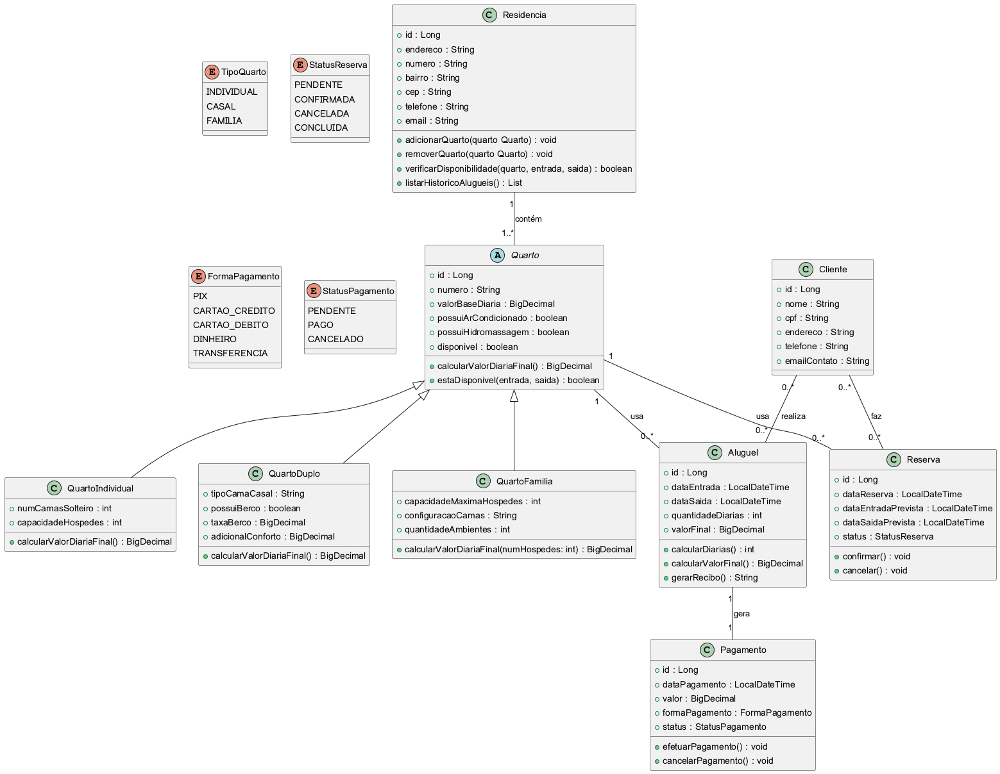

# Sistema de Hospedagem - Maraú Stay

## Descrição do Projeto

Este projeto consiste no desenvolvimento de um Sistema de Gerenciamento de Hospedagens voltado para a região de Maraú, na Bahia.

O sistema organiza o cadastro de imóveis, reservas, usuários e hospedagens, usando uma arquitetura baseada em API REST.

## Objetivo

Desenvolver um sistema completo que contemple:

- Programação orientada a objetos.
- Arquitetura em camadas: Controller, Service, Repository e Model.
- API REST com Spring Boot.
- Persistência de dados com MySQL.
- Testes automatizados.
- Tratamento de exceções.
- Aplicação de padrões de projeto.

## Funcionalidades do Sistema

- Cadastro e autenticação de usuários.
- Cadastro de imóveis.
- Listagem e busca de hospedagens.
- Realização de reservas.
- Cálculo automático do valor total da reserva.
- Sistema de tarifação flexível.
- Histórico de reservas.
- Cancelamento de reservas e aluguéis.
- Controle de quartos e regras de hospedagem.

## Sprint de Padrões de Projeto

A funcionalidade de tarifação flexível foi implementada usando:

- Strategy, para separar as regras de cálculo de tarifa.
- Singleton, para manter um gerenciador global único de tarifas.

A documentação completa da solução, com problema identificado, justificativa dos padrões, diagrama de classes atualizado e exemplos de demonstração, está em:

[SPRINT_TARIFACAO_FLEXIVEL.md](SPRINT_TARIFACAO_FLEXIVEL.md)

## Diagrama de Classes

A versão anterior do diagrama está no arquivo:

O diagrama atualizado da funcionalidade de tarifação flexível está documentado em Mermaid no arquivo da sprint.

## Tecnologias Utilizadas

- Java
- Spring Boot
- Spring Data JPA
- MySQL
- JUnit
- HTML
- CSS
- JavaScript

## Equipe de Desenvolvimento

- Lucas do Carmo Braz
- Bruno Henrique de Aguiar Xavier
- Manoel Rodrigues Bezerra Neto
- Vinícius Fernandes Mantini
- Arthur Monserrat Souza

## Considerações Finais

Este projeto aplica conceitos fundamentais e avançados de desenvolvimento de software, promovendo a construção de um sistema realista e alinhado com demandas do setor turístico.

Além disso, contribui para a valorização do turismo local e para a organização dos serviços de hospedagem em regiões de grande potencial como Maraú.
