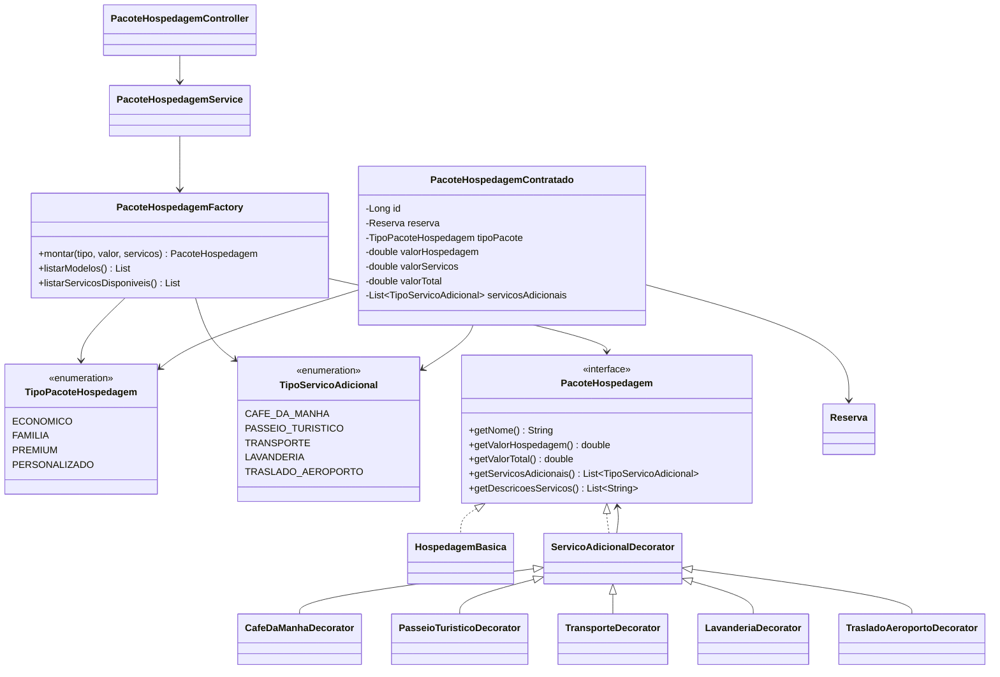

# Sprint - Montagem de Pacotes de Hospedagem

## Funcionalidade escolhida

Opção 6 - Montagem de Pacotes de Hospedagem.

O sistema agora permite montar pacotes combinando a hospedagem com serviços adicionais:

- Café da manhã;
- Passeio turístico;
- Transporte;
- Lavanderia;
- Traslado aeroporto-hospedagem.

Também foram criados modelos de pacote:

- `ECONOMICO`;
- `FAMILIA`;
- `PREMIUM`;
- `PERSONALIZADO`.

## Problema de software identificado

Sem uma arquitetura adequada, cada combinação de pacote poderia virar uma nova classe ou vários blocos de `if/else`, por exemplo:

- Pacote com café;
- Pacote com café e transporte;
- Pacote com café, transporte e lavanderia;
- Pacote com passeio e traslado;
- E assim por diante.

Isso aumentaria muito a quantidade de código repetido e dificultaria a manutenção. Sempre que um novo serviço fosse criado, várias partes do sistema precisariam ser alteradas.

## Padrões de projeto utilizados

### Decorator

O padrão Decorator foi usado para adicionar serviços extras ao pacote sem criar uma classe para cada combinação possível.

A hospedagem começa como `HospedagemBasica`. Depois, cada serviço adicional envolve o pacote anterior e acrescenta seu próprio valor e descrição.

Principais classes:

- `PacoteHospedagem`: interface comum;
- `HospedagemBasica`: componente base;
- `ServicoAdicionalDecorator`: classe abstrata dos adicionais;
- `CafeDaManhaDecorator`;
- `PasseioTuristicoDecorator`;
- `TransporteDecorator`;
- `LavanderiaDecorator`;
- `TrasladoAeroportoDecorator`.

Justificativa: novos serviços podem ser adicionados criando um novo decorator, sem alterar as classes de reserva, imóvel ou os outros serviços.

### Factory

O padrão Factory foi aplicado na classe `PacoteHospedagemFactory`.

Ela centraliza a criação dos pacotes prontos e personalizados:

- Econômico: café da manhã;
- Família: café da manhã, transporte e lavanderia;
- Premium: todos os serviços;
- Personalizado: serviços escolhidos livremente.

Justificativa: o controller e o service não precisam conhecer a ordem dos decorators nem as regras de composição dos pacotes.

## Como a funcionalidade foi implementada

Foram adicionados:

- Enum `TipoPacoteHospedagem`;
- Enum `TipoServicoAdicional`;
- Interface `PacoteHospedagem`;
- Classe `HospedagemBasica`;
- Decorators de serviços adicionais;
- Factory `PacoteHospedagemFactory`;
- Entidade `PacoteHospedagemContratado`;
- Repository `PacoteHospedagemContratadoRepository`;
- Service `PacoteHospedagemService`;
- Controller `PacoteHospedagemController`;
- DTOs de request e response;
- Tela `pacotes.html` para simular pacotes;
- Testes da montagem de pacotes.

## Diagrama de classes atualizado



## Demonstração de funcionamento

### Listar modelos e serviços disponíveis

```http
GET /pacotes/modelos
```

### Simular pacote personalizado

```http
POST /pacotes/simular
Content-Type: application/json
```

```json
{
  "valorHospedagemBase": 500,
  "tipoPacote": "PERSONALIZADO",
  "servicosAdicionais": ["CAFE_DA_MANHA", "LAVANDERIA"]
}
```

Resultado esperado:

```json
{
  "tipoPacote": "PERSONALIZADO",
  "valorHospedagem": 500.0,
  "valorServicos": 75.0,
  "valorTotal": 575.0,
  "servicosAdicionais": ["CAFE_DA_MANHA", "LAVANDERIA"]
}
```

### Contratar pacote e salvar no banco

```http
POST /pacotes
Content-Type: application/json
```

```json
{
  "reservaId": 1,
  "tipoPacote": "PREMIUM"
}
```

Quando `reservaId` é enviado, o sistema usa o valor total da reserva como valor base da hospedagem.

## Testes adicionados

- `PacoteHospedagemFactoryTest`
  - Verifica montagem de pacote personalizado;
  - Verifica pacote premium com todos os serviços principais;
  - Verifica que serviços repetidos não são duplicados.

## Como adicionar um novo serviço futuramente

1. Adicionar o novo valor no enum `TipoServicoAdicional`.
2. Criar um novo decorator estendendo `ServicoAdicionalDecorator`.
3. Registrar o decorator no `switch` da `PacoteHospedagemFactory`.

Assim, o sistema continua extensível e evita a criação de várias combinações fixas de pacotes.
