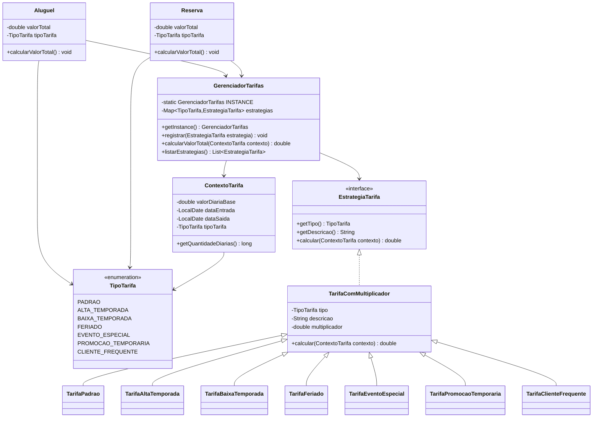

# Sprint - Sistema de Tarifacao Flexivel

## Funcionalidade escolhida

Opcao 1 - Sistema de Tarifacao Flexivel.

O sistema agora permite calcular o valor total de reservas e alugueis usando diferentes tipos de tarifa:

- `PADRAO`
- `ALTA_TEMPORADA`
- `BAIXA_TEMPORADA`
- `FERIADO`
- `EVENTO_ESPECIAL`
- `PROMOCAO_TEMPORARIA`
- `CLIENTE_FREQUENTE`

## Problema de software identificado

Antes da melhoria, o calculo do valor total era fixo:

```java
valorTotal = quantidadeDeDias * valorBase;
```

Esse modelo dificultava a evolucao do sistema. Para adicionar alta temporada, baixa temporada, feriados ou promocoes, seria necessario alterar diretamente as classes de reserva/aluguel ou criar varios `if/else` nos controllers.

Isso viola o principio aberto/fechado, pois o codigo existente precisaria ser alterado sempre que uma nova regra de tarifa fosse criada.

## Padroes de projeto utilizados

### Strategy

O padrao Strategy foi usado para separar cada regra de calculo em uma classe propria.

Principais classes:

- `EstrategiaTarifa`: interface comum das estrategias.
- `TarifaPadrao`
- `TarifaAltaTemporada`
- `TarifaBaixaTemporada`
- `TarifaFeriado`
- `TarifaEventoEspecial`
- `TarifaPromocaoTemporaria`
- `TarifaClienteFrequente`

Com isso, cada regra fica isolada e pode evoluir sem misturar logica de preco com controller, entidade ou repositorio.

### Singleton

O padrao Singleton foi aplicado na classe `GerenciadorTarifas`.

Essa classe representa um catalogo global de estrategias de tarifa disponiveis no sistema. A existencia de uma unica instancia evita que diferentes partes da aplicacao tenham listas diferentes de regras de preco.

Uso:

```java
GerenciadorTarifas.getInstance().calcularValorTotal(contexto);
```

Justificativa: o conjunto de tarifas deve ser unico e compartilhado por reservas, alugueis, simulacoes e futuras funcionalidades de relatorio.

## Como a funcionalidade foi implementada

Foram adicionados:

- Enum `TipoTarifa`, com os tipos de tarifa aceitos.
- Classe `ContextoTarifa`, com valor base, datas e tipo de tarifa.
- Interface `EstrategiaTarifa`.
- Estrategias concretas para cada regra de calculo.
- Singleton `GerenciadorTarifas`.
- Endpoint `GET /tarifas` para listar tarifas disponiveis.
- Endpoint `GET /tarifas/simular` para demonstrar o calculo sem depender do banco.
- Campo `tipoTarifa` em `Reserva` e `Aluguel`.
- Campo visual de selecao de tarifa na tela `reserva.html`.
- Coluna de tarifa no painel `dashboard.html`.

## Diagrama de classes atualizado



## Demonstracao de funcionamento

### Listar tarifas

```http
GET /tarifas
```

### Simular calculo

```http
GET /tarifas/simular?valorBase=200&entrada=2026-12-20&saida=2026-12-25&tipo=ALTA_TEMPORADA
```

Resultado esperado:

```json
{
  "tipoTarifa": "ALTA_TEMPORADA",
  "valorBase": 200.0,
  "diarias": 5,
  "valorTotal": 1300.0
}
```

### Criar reserva com tarifa flexivel

```http
POST /reservas
Content-Type: application/json
```

```json
{
  "usuario": { "id": 1 },
  "imovel": { "id": 1 },
  "checkin": "2026-12-20",
  "checkout": "2026-12-25",
  "quantidadeHospedes": 2,
  "tipoTarifa": "ALTA_TEMPORADA"
}
```

## Testes adicionados

- `GerenciadorTarifasTest`
  - Verifica que o Singleton retorna sempre a mesma instancia.
  - Verifica calculo de promocao temporaria.
  - Verifica estrategias cadastradas.

- `HospedagemServiceTest`
  - Verifica calculo com alta temporada.
  - Verifica desconto para cliente frequente.

## Como adicionar uma nova tarifa

1. Adicionar o novo valor no enum `TipoTarifa`.
2. Criar uma nova classe implementando `EstrategiaTarifa` ou estendendo `TarifaComMultiplicador`.
3. Registrar a estrategia no construtor do `GerenciadorTarifas`.

Assim, a nova regra fica isolada e nao exige alterar controllers, repositorios ou telas principais.
